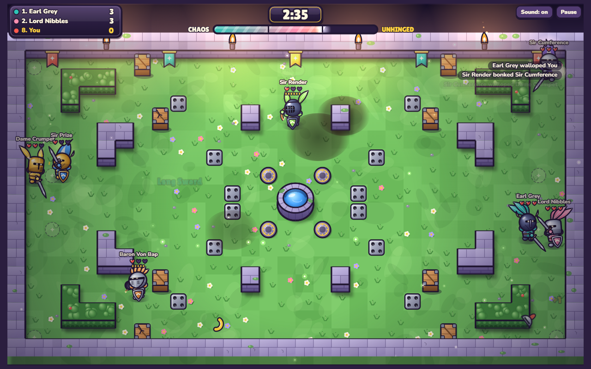
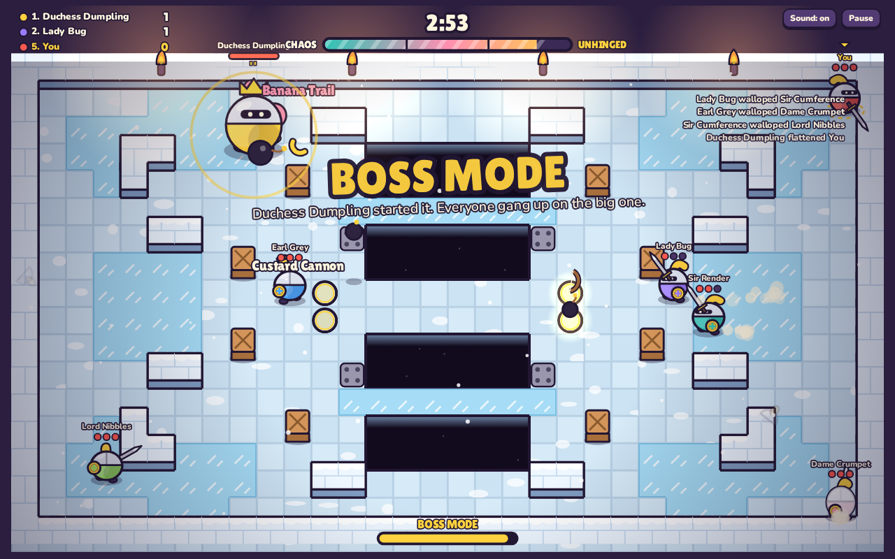
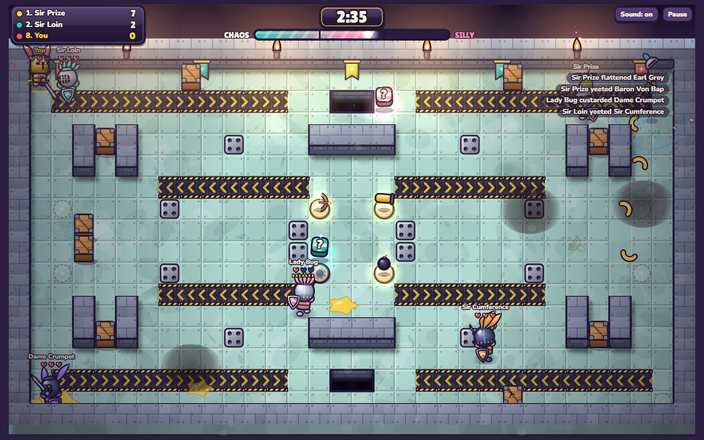

# Custard Knights

A cartoon top-down arena brawler for 8 knights. You fight bots, a friend on the same keyboard, friends online, or all of them at once. The power-ups start sensible and get sillier as the match goes on.

This is a browser prototype built to test the feel before a proper build (Godot 4, online play, proximity voice).

## Play

Open `index.html` in any modern browser. Nothing to install.

To host it for free, turn on **GitHub Pages** (Settings → Pages → Deploy from branch → `main` / root). The game is then live at `https://<your-username>.github.io/<repo-name>/`.

## What's in it

- **3 arenas:** Castle Courtyard (hedge maze, well, spike traps), Frosty Keep (ice and a chasm with bridges), Pie Factory (conveyor belts that carry you into pits)
- **Hazards:** pits, spike traps that pop on a timer, ice, conveyor belts, breakable crates that sometimes hide a power-up
- **Weapon pads:** Bow, Bomb Bag and Custard Cannon. Picking up the same weapon again levels it up.
- **Shield block:** stops sword hits and bounces arrows back at the shooter
- **Chaos Meter:** fills with time and knockouts and unlocks three tiers of power-ups
  - Sensible: Zoomy Boots, Bubble Shield, Long Sword, Pork Pie
  - Silly: Giant Head, Bouncy Arms, Swap-o-matic, Banana Trail, Ghost Mode
  - Unhinged: Chicken Party, Custard Flood, Boss Mode, Disco Fever, Mirror Curse, Tiny Town
- **Modes:** Free-for-all, or Red vs Blue (both humans on the same team against the bots)
- **Bots:** Chill, Spicy or Brutal. They find their way through the mazes, grab weapons, block and dodge spikes.
- **Shouts:** speech bubbles fade with distance, standing in for proximity chat
- **Online play:** one player hosts a room and gets a 5-letter code and invite link. Up to 8 knights join from their own browsers and bots fill the empty spots. The host's browser runs the match. Players connect directly through [PeerJS](https://peerjs.com/), so there's no server to run.
- **The Power of Steve:** once a match, an announcer drops a golden egg. Whoever grabs it rides Steve, a giant cockerel, for 14 seconds: faster, bigger, flies over pits and tramples everyone.
- **Menu theme:** "Custard Knights" plays on the menu, fades out when the brawl starts, and follows the Sound button

## Controls

| | Move | Swing / fire | Dash | Block | Shout |
|---|---|---|---|---|---|
| Just me | WASD or Arrows | Space / J | Shift / K | E / L | 1–4 |
| Player 1 | WASD | F | G | H | 1–4 |
| Player 2 | Arrows | K | L | J | 7–0 |

Touch devices get an on-screen stick plus Swing, Dash and Block buttons. Pause with P or Esc. Dashing carries you over pits.

## Screenshots

| Frosty Keep | Pie Factory |
|---|---|
|  |  |

## Ideas for next

- Pie Heist: carry the pie back to your base (Red vs Blue)
- Proximity voice for online matches
- More arenas and weapons
