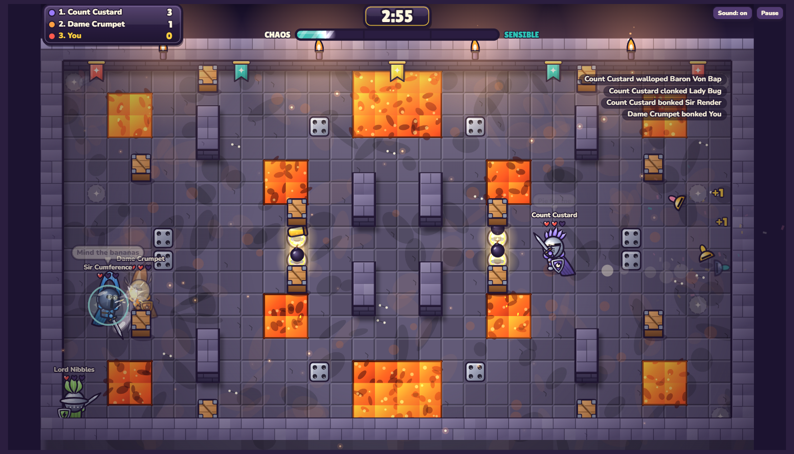
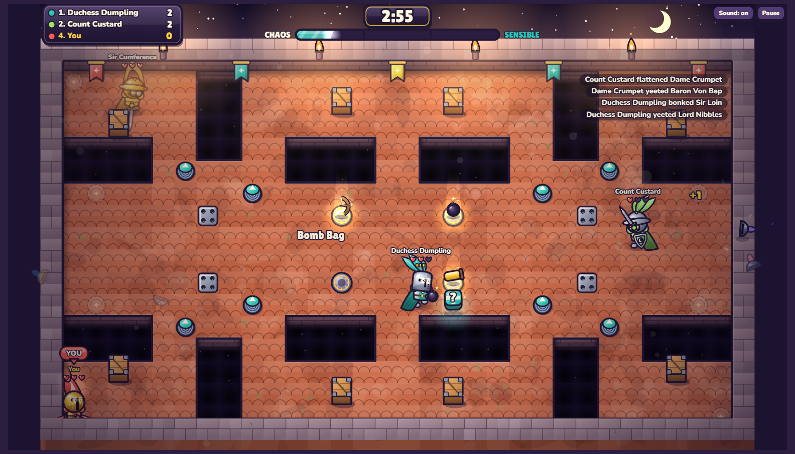
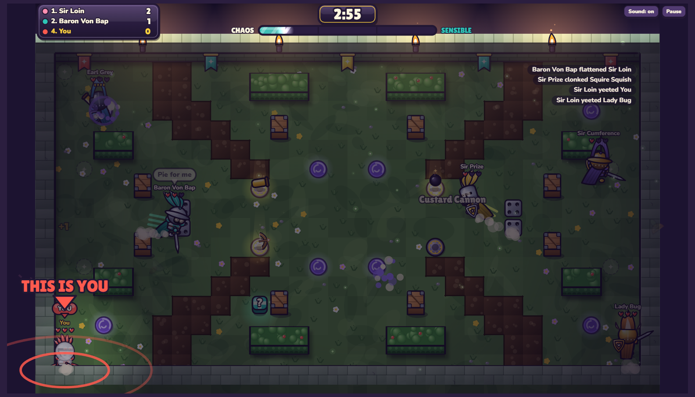

# Custard Knights

A cartoon top-down arena brawler for 8 knights. You fight bots, a friend on the same keyboard, friends online, or all of them at once. The power-ups start sensible and get sillier as the match goes on.

This is a browser prototype built to test the feel before a proper build (Godot 4, online play, proximity voice).

## Play

Open `index.html` in any modern browser. Nothing to install.

To host it for free, turn on **GitHub Pages** (Settings → Pages → Deploy from branch → `main` / root). The game is then live at `https://<your-username>.github.io/<repo-name>/`.

## What's in it

- **6 arenas:** Castle Courtyard (hedge maze, well, spike traps), Frosty Keep (ice and a chasm with bridges), Pie Factory (conveyor belts that carry you into pits), Dragon's Larder (lava pools and a lava river), Rooftop Rumble (rooftops split by drops, with springs to bounce across), Custard Bog (a mud river that slows you down, and portals)
- **Hazards:** pits, spike traps that pop on a timer, ice, conveyor belts, lava that burns and shoves you back, mud, springs that launch you the way you are moving, portals that drop you at a random other portal, breakable crates that sometimes hide a power-up
- **Weapon pads:** Bow, Bomb Bag and Custard Cannon. Picking up the same weapon again levels it up.
- **Shield block:** stops sword hits and bounces arrows back at the shooter
- **Chaos Meter:** fills with time and knockouts and unlocks three tiers of power-ups
  - Sensible: Zoomy Boots, Bubble Shield, Long Sword, Pork Pie, Magnet Mitts (pulls power-ups to you), Prickly Armour (whoever hits you gets hurt back)
  - Silly: Giant Head, Bouncy Arms, Swap-o-matic, Banana Trail, Ghost Mode, Bee Swarm (a swarm that hunts your nearest enemy), Pie Traps (three pies on the floor that explode when an enemy steps on them)
  - Unhinged: Chicken Party, Custard Flood, Boss Mode, Disco Fever, Mirror Curse, Tiny Town, Meteor Shower (custard falls from the sky, you are immune), Lights Out (only a small circle around each knight is lit, yours is bigger), Jelly Arena (walls bounce and every hit sends people flying), Swap Party (everyone swaps places every two seconds)
- **Arena events:** every half a minute or so the arena itself does something, with a red banner and a countdown: Trapdoors (cracks appear, then the floor opens), Pie Catapult (the castle lobs pies at the leaders), Chicken Stampede (a flock runs across and tramples anyone in the way), Gale Force (everyone is pushed one way), Slow-mo, Bounty (three points to whoever knocks out the leader) and Supply Drop (everyone gets a weapon, power-ups land in the middle)
- **Modes:** Free-for-all, or Red vs Blue (both humans on the same team against the bots)
- **Bots:** Chill, Spicy or Brutal. They find their way through the mazes, grab weapons, block and dodge spikes.
- **Shouts:** speech bubbles fade with distance, standing in for proximity chat
- **Online play:** one player hosts a room and gets a 5-letter code and invite link. Up to 8 knights join from their own browsers and bots fill the empty spots. The host's browser runs the match. Players connect directly through [PeerJS](https://peerjs.com/), so there's no server to run.
- **The Power of Steve:** once a match, an announcer drops a golden egg. Whoever grabs it rides Steve, a giant cockerel, for 14 seconds: faster, bigger, flies over pits and tramples everyone.
- **The Power of Norr:** now and then a shepherd's pie appears somewhere in the arena. Eat it and you let out a NORRRRRRRR that blasts everyone nearby across the map, then for 12 seconds you are bigger, faster, hit for double and roar again every couple of seconds. Bots panic and run.
- **Finding yourself:** your knight has a YOU tag (P1 and P2 on a shared keyboard), a coloured ring at its feet, and a spotlight with a big "THIS IS YOU" pointer at the start of the match and every time you respawn
- **Knights:** each knight has a flowing cape, a heraldic emblem on tabard and shield, glowing eyes that glare when swinging and squint when blocking, and one of six helmets (great helm, sallet, horned, crested, kettle hat, barbute) with feather, twin, mohawk, flame or brush plumes
- **Menu theme:** "Custard Knights" plays on the menu, fades out when the brawl starts, and follows the Sound button

## Controls

| | Move | Swing / fire | Dash | Block | Shout |
|---|---|---|---|---|---|
| Just me | WASD or Arrows | Space / J | Shift / K | E / L | 1–4 |
| Player 1 | WASD | F | G | H | 1–4 |
| Player 2 | Arrows | K | L | J | 7–0 |

Touch devices get an on-screen stick plus Swing, Dash and Block buttons. Pause with P or Esc. Dashing carries you over pits.

## Screenshots

| Frosty Keep | Pie Factory |
|---|---|
|  |  |

| Dragon's Larder | Rooftop Rumble | Custard Bog |
|---|---|---|
|  |  |  |

## Ideas for next

- Pie Heist: carry the pie back to your base (Red vs Blue)
- Proximity voice for online matches
- More weapons
- Wire the power of Norr up to a proper roar recording
