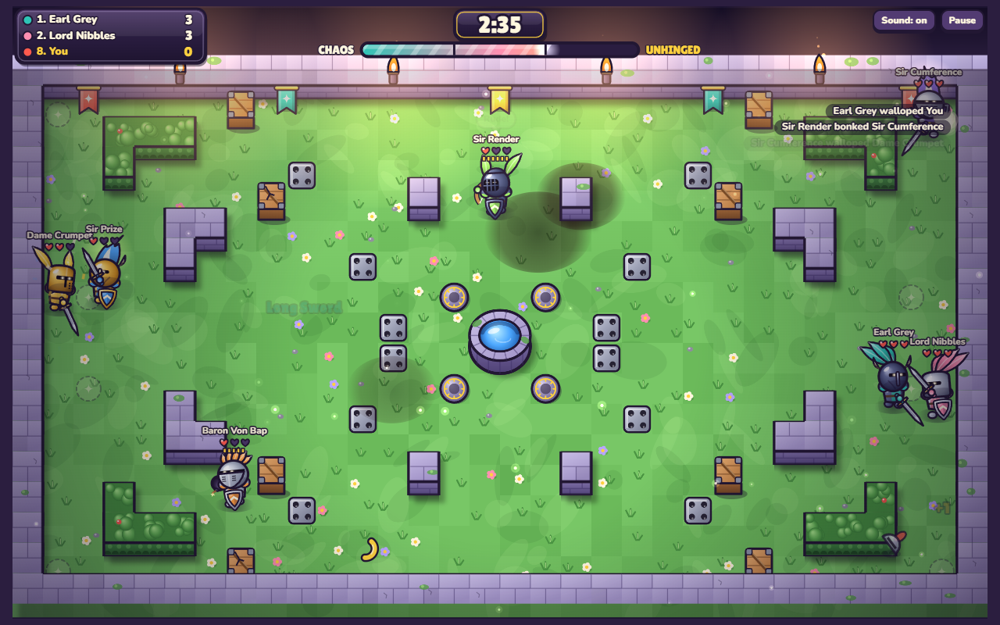
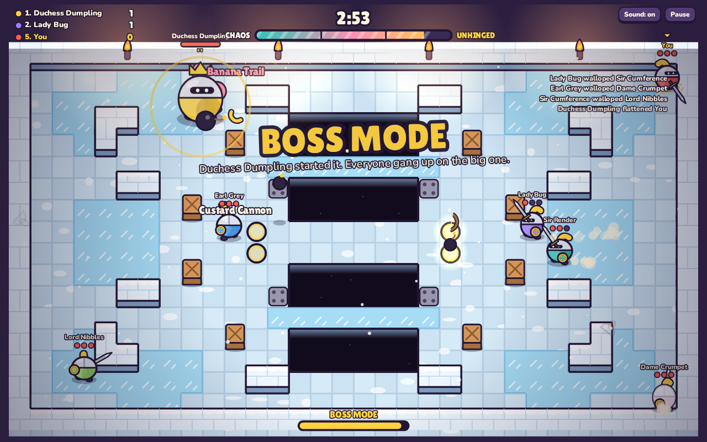
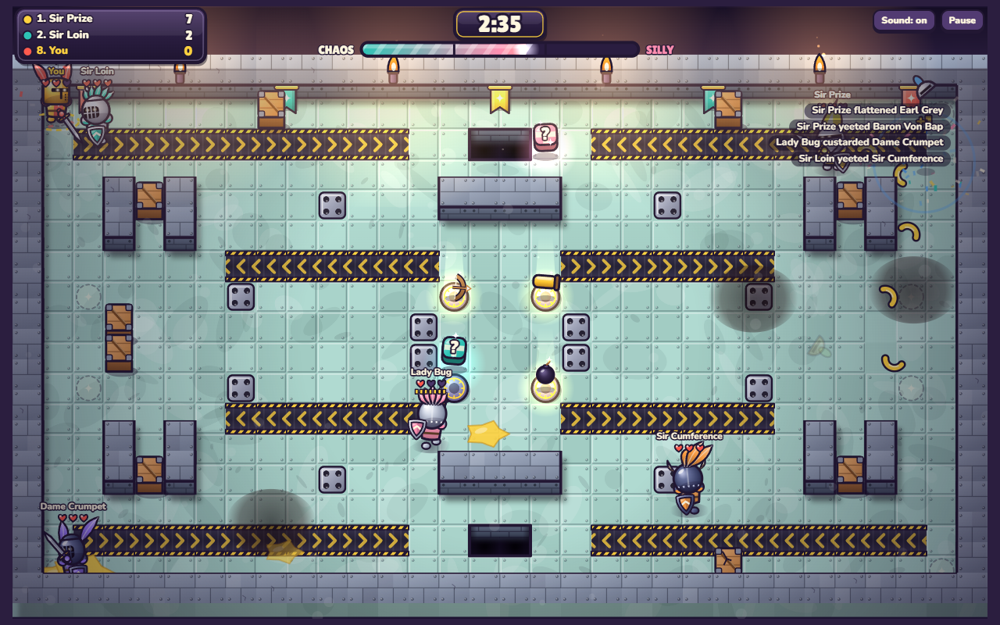
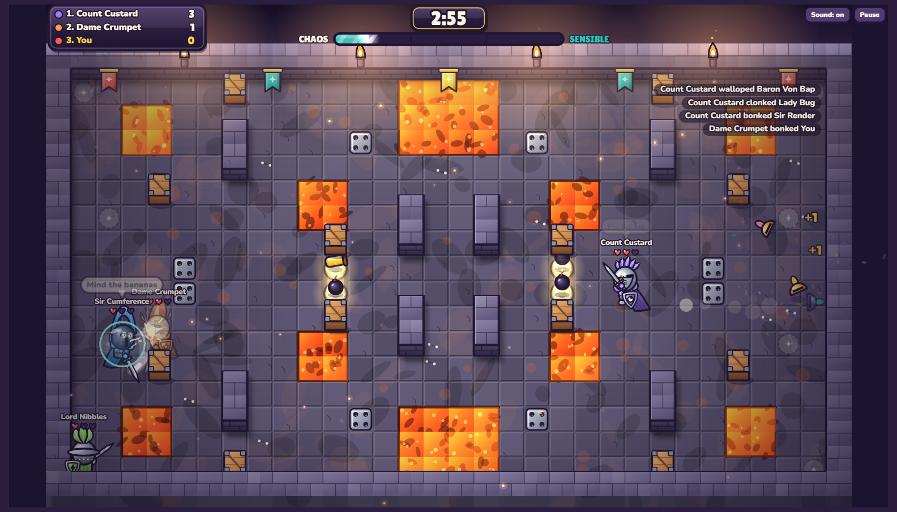
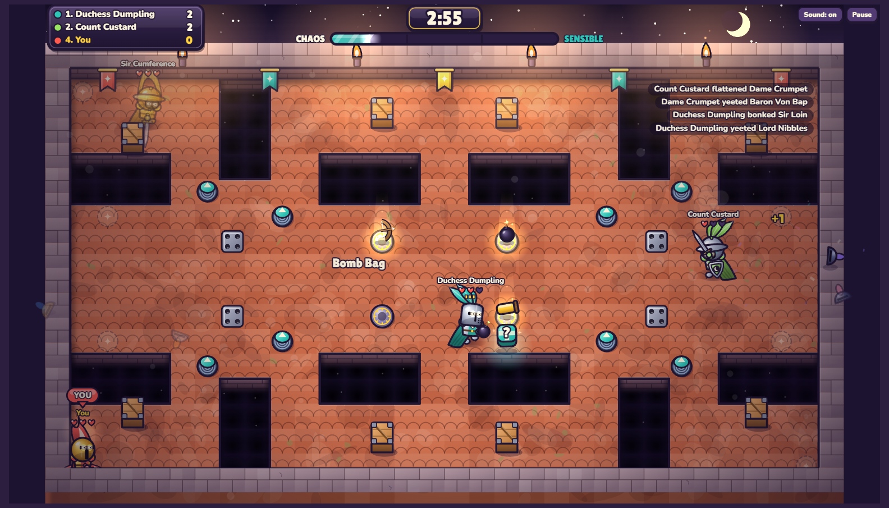
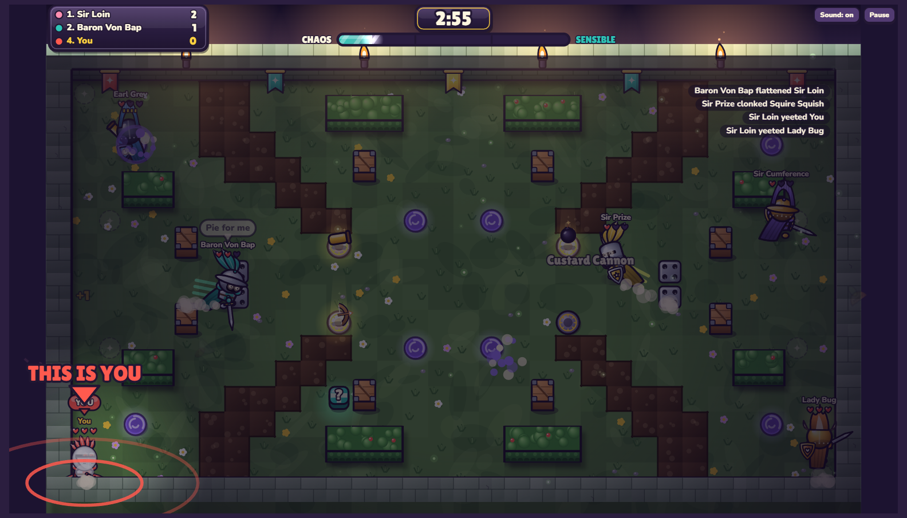

# Custard Knights

**Current development preview: 0.3.0-alpha.3.** Faction battles and four difficulty levels are in progress. Read [the cross-machine checkpoint](release/RESUME-CHECKPOINT.md) for setup, evidence and known test failures before continuing work or making release claims.

**Development plan:** [Master build plan](BUILD-PLAN.md), covering gameplay feel, graphics and animation, the solo campaign, party Cups, earned cosmetics and validation. The [launch status](release/LAUNCH-STATUS.md) records what is implemented and tested; the plan also contains future work.

A cartoon top-down arena brawler for 8 knights. You fight bots, a friend on the same keyboard, friends online, or all of them at once. The power-ups start sensible and get sillier as the match goes on.

This is a playable browser game with local and online play, plus a Windows candidate under preparation for Steam. See the [release handoff](release/STEAM-HANDOFF.md) for build commands, verified checks and remaining release gates. The first eight campaign encounters, three-round Custard Cup and six-item earned collection are implemented.

## Play

Open `index.html` in any modern browser. Nothing to install.

For the Windows build, run `npm ci`, `npm run package:win`, then launch `dist/Custard Knights-win32-x64/Custard Knights.exe`. Keep the whole output folder together. F11 toggles fullscreen. See the [twelve-track Suno brief](release/SUNO-SOUNDTRACK.md) for the soundtrack prompts and export filenames; only the existing menu theme is included until more recordings are added.

To host it for free, turn on **GitHub Pages** (Settings → Pages → Deploy from branch → `main` / root). The game is then live at `https://<your-username>.github.io/<repo-name>/`.

For friends: see the [playtest kit guide](release/playtest/README.md). The complete ZIP includes the Windows game, setup instructions and an offline feedback form; do not send the EXE alone.

## What's in it

- **Faction Front (preview):** Brawl, Capture the Flag and Siege at 4v4, 20v20 or 50v50 total slots, with bot fill and four tactical roles. Bot practice works offline. Online faction rooms need a separate server; no public hosted service or persistent ranked ladder is included.
- **The Great Pudding War:** eight authored story encounters, optional spoon goals, checkpoints, assistance, Steve rescue and a two-phase boss.
- **Custard Cup:** three linked rounds, human standings, arena votes, ready-up and event-backed awards.
- **Earned collection:** six extra cosmetics, first reward choice, pinned goals, retained partial progress, previews, three outfits and validated progression/campaign backups.
- **Visor choice:** free closed and open options for every helmet, saved with outfits and shown online. Closed is the default; open keeps small eyes recessed inside the helmet.
- **6 arenas:** Castle Courtyard (hedge maze, well, spike traps), Frosty Keep (ice and a chasm with bridges), Pie Factory (conveyor belts that carry you into pits), Dragon's Larder (lava pools and a lava river), Rooftop Rumble (rooftops split by drops, with springs to bounce across), Custard Bog (a mud river that slows you down, and portals)
- **Hazards:** pits, spike traps that pop on a timer, ice, conveyor belts, lava that burns and shoves you back, mud, springs that launch you the way you are moving, portals that drop you at a random other portal, breakable crates that sometimes hide a power-up
- **Weapon pads:** Bow, Bomb Bag and Custard Cannon. Picking up the same weapon again levels it up.
- **Shield block:** stops sword hits and bounces arrows back at the shooter
- **Chaos Meter:** fills with time and knockouts and unlocks three tiers of power-ups
  - Sensible: Zoomy Boots, Bubble Shield, Long Sword, Pork Pie, Custard Potion, Magnet Mitts (pulls power-ups to you), Prickly Armour (whoever hits you gets hurt back)
  - Silly: Giant Head, Bouncy Arms, Swap-o-matic, Banana Trail, Ghost Mode, Bee Swarm (a swarm that hunts your nearest enemy), Pie Traps (three pies on the floor that explode when an enemy steps on them)
  - Unhinged: Chicken Party, Custard Flood, Boss Mode, Disco Fever, Mirror Curse, Tiny Town, Meteor Shower (custard falls from the sky, you are immune), Lights Out (only a small circle around each knight is lit, yours is bigger), Jelly Arena (walls bounce and every hit sends people flying), Swap Party (everyone swaps places every two seconds)
- **Arena events:** every half a minute or so the arena itself does something, with a red banner and a countdown: Trapdoors (cracks appear, then the floor opens), Pie Catapult (the castle lobs pies at the leaders), Chicken Stampede (a flock runs across and tramples anyone in the way), Gale Force (everyone is pushed one way), Slow-mo, Bounty (three points to whoever knocks out the leader) and Supply Drop (everyone gets a weapon, power-ups land in the middle)
- **Modes:** Free-for-all, Red vs Blue (humans on the same team or split up), Last Knight Standing (three lives, then you are a chicken who can still peck), King of the Pie (stand alone on a giant pie that moves every 30 seconds, first to 60), Pie Heist (Red vs Blue, steal the enemy pie and carry it home, first to 3) Chicken Racing (everyone is a chicken, four laps round the arena, peck to shove) Flag Frenzy (Red vs Blue over three flags; stand by one to turn it your colour, held flags score, first to 100) and Hot Pie (a pie with a lit fuse, whack someone to pass it, boom costs a life, last knight standing wins). Team modes mark each side's base on the floor.
- **Combat:** light swings, a charged heavy that breaks blocks, dash with i-frames and a dash-attack stab, a parry window when you block just as they swing (with a riposte), a guard meter, shield bash, ring-out knockback that grows as you get hurt, hitstun, and two seconds of real spawn protection that ends the moment you attack
- **Bots:** Easy, Medium, Hard and STEVE change reactions, accuracy, pressure and defensive decisions. Bots share human base movement speed; human difficulty calibration remains part of playtesting.
- **Menu:** Quick brawl, Custom brawl with mode and arena cards, chaos speed and match length, an online screen with an invite landing card, a Wardrobe with a live knight preview (helm, plume, metal, emblem, colour, name, for four local players), How to play, and Settings (music, sounds, screen shake, reduce flashing, show every name)
- **Earn everything:** matches pay out Custard Coins (3 for playing, 1 per KO, 5 for a win, plus mode bonuses). An 18-tier track unlocks cape patterns, blade skins (wooden, baguette, fish, candy cane, spoon), extra colours and chicken skins for when you are a chicken, and six challenges unlock specific items early. Everything is cosmetic. There is no shop, no currency to buy and nothing that changes how you fight.
- **Stacking:** power-ups stack. A second Long Sword makes it longer still (three levels), Zoomy Boots get zoomier, Bubble Shield holds up to three bubbles, and durations add up. The Custard Potion gives a heart now and one every six seconds for a while.
- **Pads:** up to four gamepads. Left stick moves, right stick aims, A swings, B dashes, X blocks, Y shouts, Start pauses. The menus work from the d-pad.
- **Teaching:** a control card at the start until you have landed three hits, a death card that tells you what got you and what to do about it, one-line tips the first time you meet a pit, ice, a bow or a bounty, captions on power-ups, and a banner each time the Chaos Meter changes tier
- **Shouts:** speech bubbles fade with distance, standing in for proximity chat
- **Online play:** one player hosts a room and gets a 5-letter code and invite link. Up to 8 knights join from their own browsers and bots fill the empty spots. The host's browser runs the match. Players connect directly through [PeerJS](https://peerjs.com/), so there's no server to run.
- **The Power of Steve:** once a match, an announcer drops a golden egg. Whoever grabs it rides Steve, a giant cockerel, for 10 seconds: faster, bigger, flies over pits and tramples everyone.
- **The Power of Norr:** now and then a shepherd's pie appears somewhere in the arena. Eat it and you let out a NORRRRRRRR that blasts everyone nearby across the map, then for 12 seconds you are bigger, faster, hit for double and roar again every couple of seconds. Bots panic and run.
- **Finding yourself:** your knight has a YOU tag (P1 and P2 on a shared keyboard), a coloured ring at its feet, and a spotlight with a big "THIS IS YOU" pointer at the start of the match and every time you respawn
- **Knights:** each knight has a flowing cape, a heraldic emblem on tabard and shield, a choice of a closed visor or small recessed eyes behind an open visor, and one of six helmets (great helm, sallet, horned, crested, kettle hat, barbute) with feather, twin, mohawk, flame or brush plumes
- **Menu theme:** "Custard Knights" plays on the menu, fades out when the brawl starts, and follows the Sound button

## Controls

| | Move | Swing / fire | Dash | Block | Shout |
|---|---|---|---|---|---|
| Just me | WASD or Arrows | Space / J | Shift / K | E / L | 1–4 |
| Player 1 | WASD | F | G | H | 1–4 |
| Player 2 | Arrows | J | K | L | 7–0 |

Touch devices get an on-screen stick plus Swing, Dash and Block buttons. Pause with P or Esc. Dashing carries you over pits.

## Screenshots

| Frosty Keep | Pie Factory |
|---|---|
|  |  |

| Dragon's Larder | Rooftop Rumble | Custard Bog |
|---|---|---|
|  |  |  |

## QA agents

`node qa/run.js` plays full matches in headless Chrome with scripted player personas (rusher, camper, collector, pacifist, fuzzer, idle, parrier, pro) and writes a summary of pace, hazard deaths, spawn deaths, what kills people, combat feel and every mode ending cleanly. See [QA documentation](qa/README.md). Five historical reviewer reports (combat, level design, art direction, Steam Early Access readiness, first five minutes) are in `qa/reviews/`; several of their proposed fixes are already implemented. Use the master build plan for current priorities.

## Planned development

These documents retain design proposals and research. The implemented first chapter, Cup and collection are described in the release handoff; later kingdoms and unvalidated experiments remain proposals.

- [Master build plan](BUILD-PLAN.md): gameplay and graphics improvements, delivery sequence, 24 work items and acceptance checks.
- [Player-behaviour roadmap](PLAYER-BEHAVIOUR-ROADMAP.md): research, retention hypotheses, experiments and measurement.
- [The Great Pudding War](THE-GREAT-PUDDING-WAR.md): dessert kingdoms, story map, first chapter and bosses.
- [Cosmetic progression](COSMETIC-PROGRESSION.md): desirable gameplay-earned rewards, previews and collection goals. No microtransactions or combat advantages.

The current pass refines combat animation and gameplay readability on the packaged baseline. Additional kingdoms and recording features remain future work. Steam account/review and real hardware/network checks still gate release. Proximity voice and an engine rewrite are deferred.
